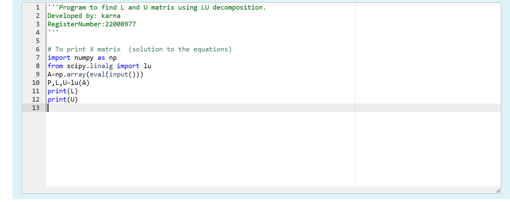
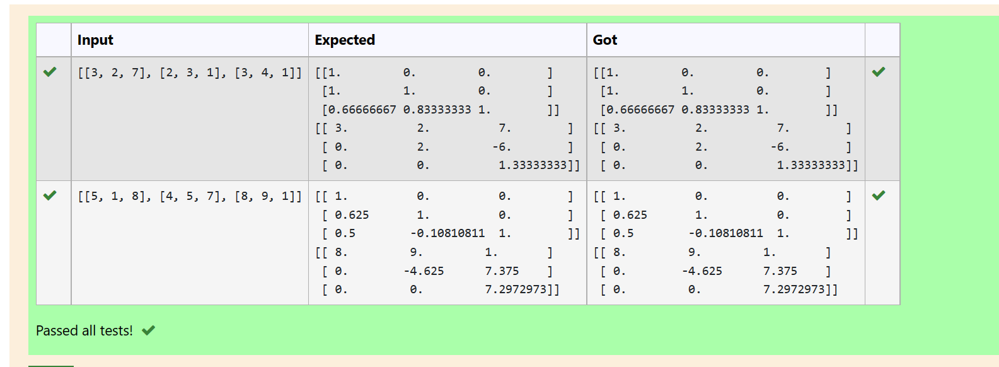
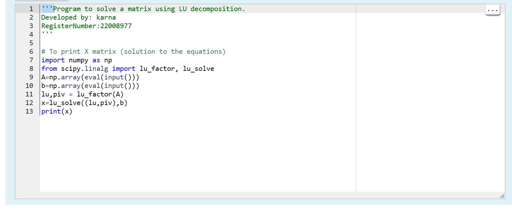
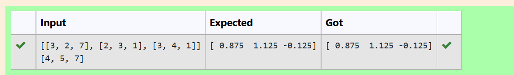

# LU Decomposition 

## AIM:
To write a program to find the LU Decomposition of a matrix.

## Equipments Required:
1. Hardware – PCs
2. Anaconda – Python 3.7 Installation / Moodle-Code Runner

## Algorithm
1. 
2. 
3. 
4. 
# Program:

# i) To find the L and U matrix

## Output:

# ii) To find the LU Decomposition of a matrix 

## Output:

## Result:
Thus the program to find the LU Decomposition of a matrix is written and verified using python programming.

